# Workout Logbook Server

This is my first go at building a server without step-by-step instructions. It went a lot smoother than I anticipated!

## Notes
- I like to put emojis in my code, but not just to be daft, but because they are easy to spot in the console! They are also good associative tools for me. I will remove them if they are too out-of-place, and I would *probably* not ship code with them in a professional setting. 
- I also learned a bit of **Markdown**!

## Process

I began by building out my file and folder structure and installing modules. I made a point to name things a bit differently than in the journal walkthrough in order to grasp where things are feeding into.

1. **app.js** and **db.js**
   - I brought elements in as I needed them to the *app.js* file. I took time to make sure I understoof the purpose of each.
   - I tried a different method for connecting to port. Specifically, I used an environment variable, and the sequelize method `authenticate()`.  
  
        ```db.authenticate()
        .then(() => db.sync())
        .then(() => {
          app.listen(process.env.PORT, () => {
            console.log(`The app is listening on port ${process.env.PORT}`)
          })
        })
        .catch(err => {
          console.error(`Something went wrong!`, err)
        }) 
        ```
2. **Models**  
   - I first built the *User* model.  
   - I then built the *Log* model.  
3. **Controllers**  
   - The *userController* worked perfectly out of the gate, but I was having issues testing the *logController* at this point, so I then moved on and built out my middleware.
4. **Middleware** 
   - I would be lying if I said I fully understand headers at this point.  
   - The validateSesh flow, on the other hand, makes a lot of sense! Maybe because we had to supply a token in Postman, so I knew exactly the purpose.  
5. **Testing**
   - I tested and debugged all of my endpoints. Here are some screenshots:
  

    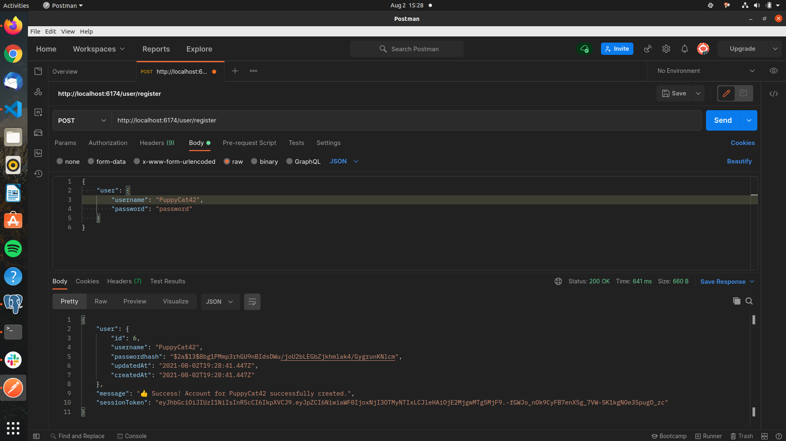
    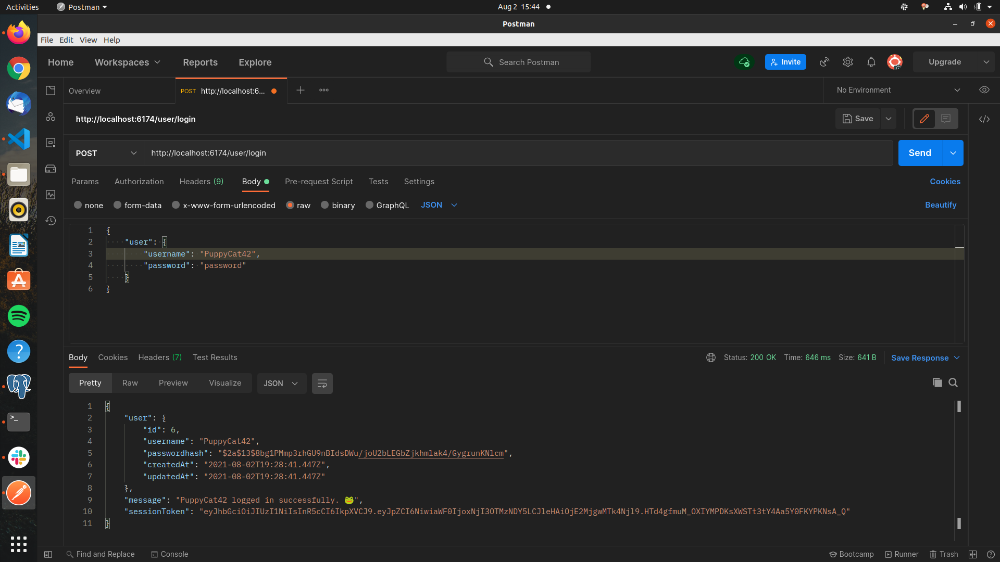
    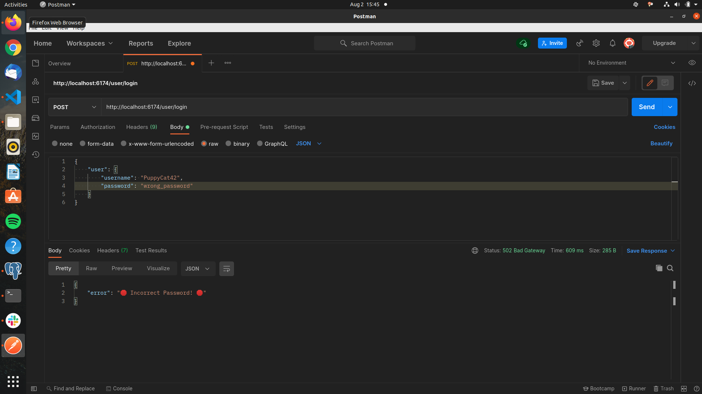
    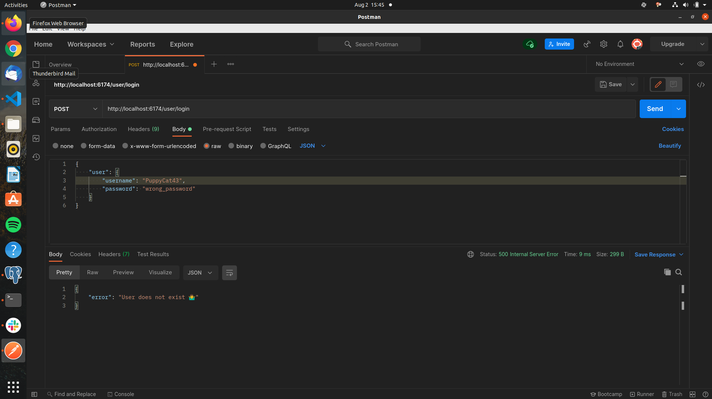
    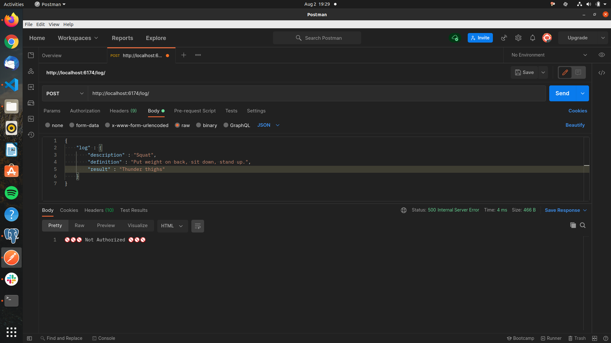
    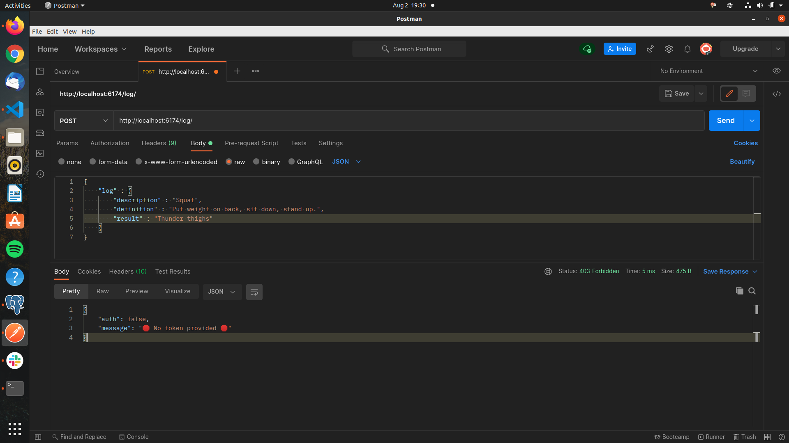
    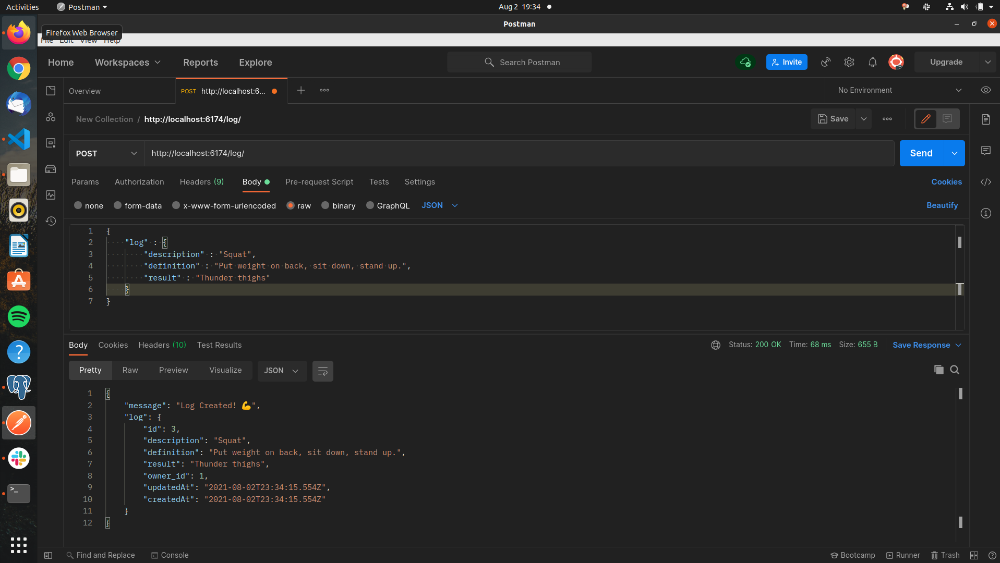
    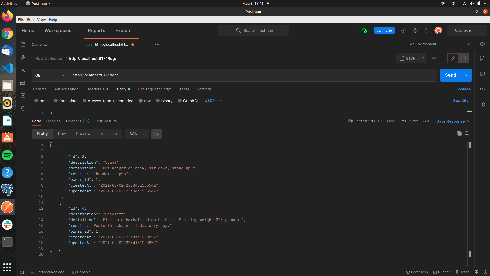
    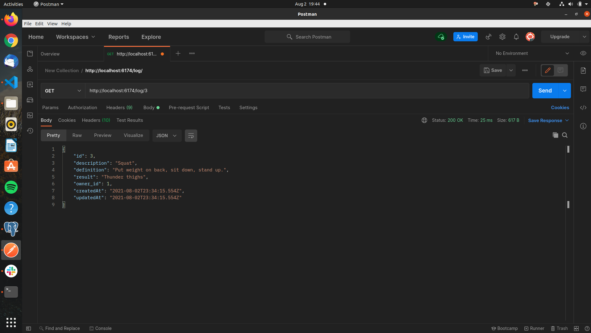
    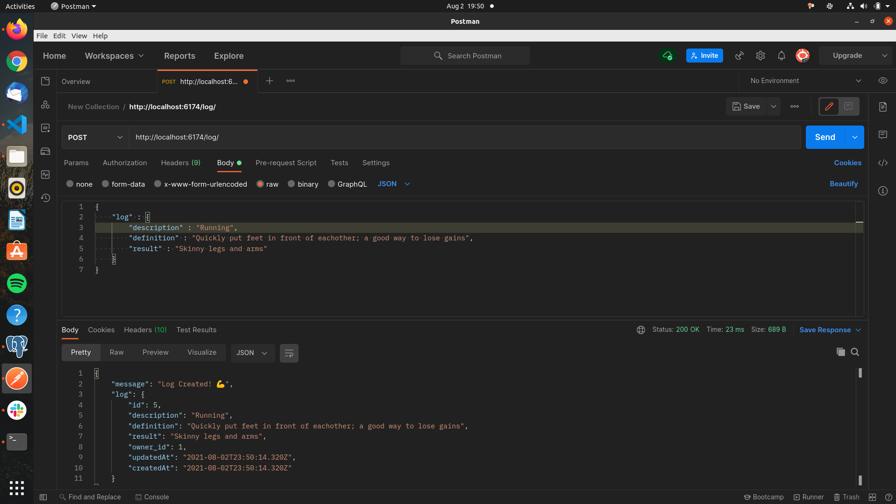
    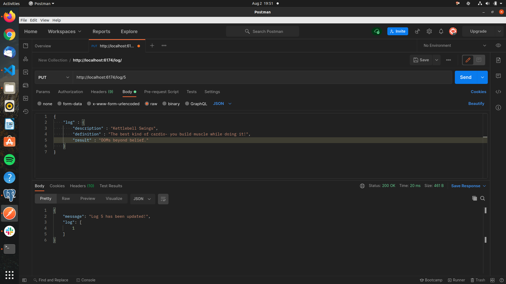
    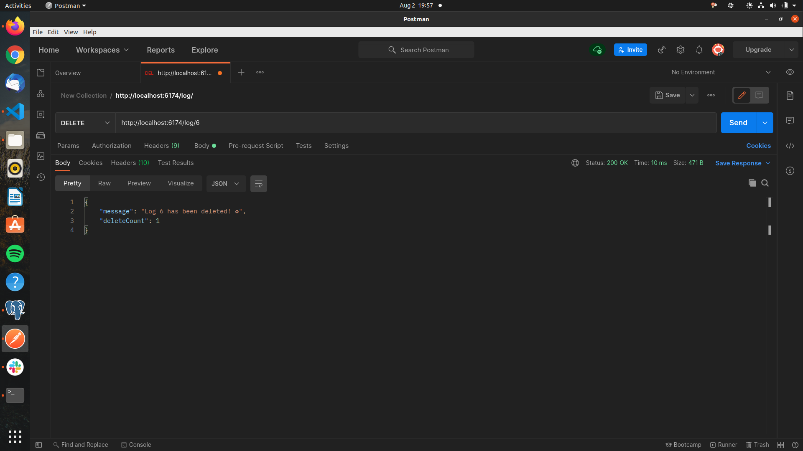

